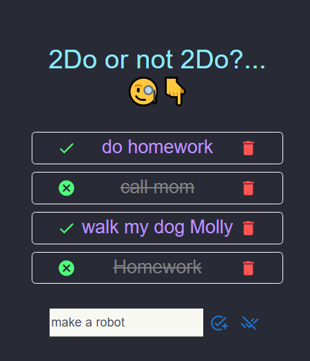

<h1>Simple TODO App made with react ✍</h1>
<h3>How to Setup 🛠</h3>
<ol>
<li>download Node.js</li>
<li>In destination Folder, run `npm install` to install dependencies</li>
<li >`npm start` to start the app</li>
<li>Have fun XD</li>
</ol>

